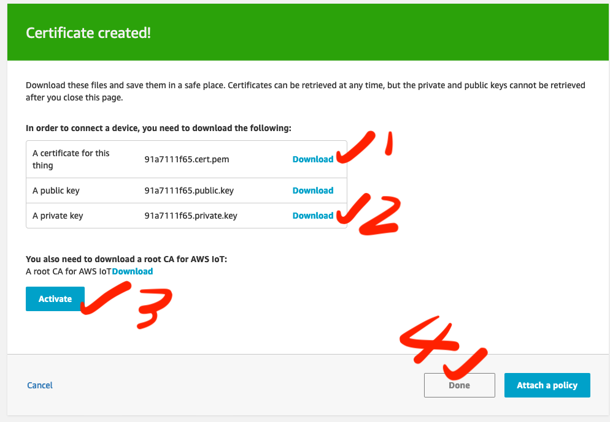
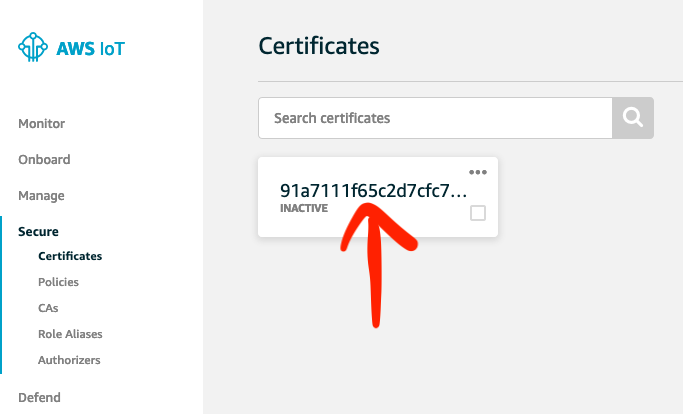
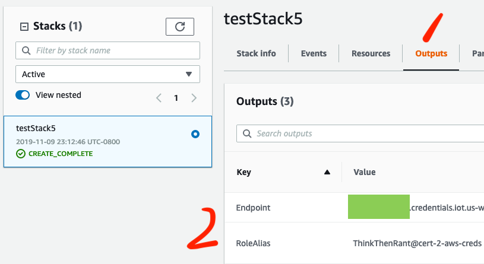
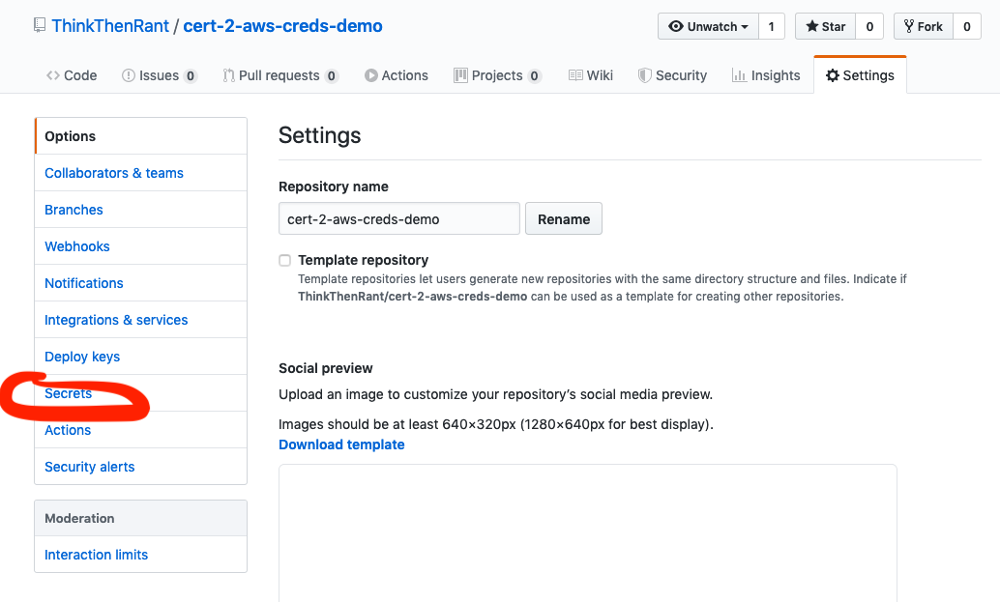

# cert-2-aws-creds is a GitHub Action that retrieves AWS STS temporary credentials using an X.509 certificate


The inner working of this action can be read in detailed on https://docs.aws.amazon.com/iot/latest/developerguide/authorizing-direct-aws.html. For the impatients, essentially
this Action uses a certificate that is trusted by AWS and the associated private key (DO NOT check in your private key! I repeat, DO NOT check it in. Store it in your GitHub repository as a secret).

## Infrastructure set up
### IoT certificate creation
The use of this action requires an one-time provision of AWS resources. First, head to the AWS console, choose IoT service and create a certificate under the "Secure" tab. The one-click solution should be the easiest:


Download the generated certificate, private key (you can safely ignore the Amazon root CA and public key). Don't forget to click the "Activate" button, then click "Done". We don't have to attach any policy now because it will be taken care of in the next step.



After the creation process completes, click on your certificate and jot down its ARN:


### Remaining resources provisioning
Head to the Cloudformation console, create a new stack with the provided template [here](action_infrastructure/cloudformation.yml). During the stack provisioning process, you'll have a chance to provide the certificate ARN and some other configurations, such as the GitHub repository you are adding this action to, as parameters to the stack.

After the stack successfully created, head to the Outputs tab and jot down the 2 outputs: "Endpoint" and "RoleAlias". Both will be used as inputs when this Action is added to your repository's workflow:


The stack also attaches an appropriate IoT policy to the certificate you provided as one of the stack parameters.

### Add the Action to your GitHub workflow
Store the content of your certificate and private key as GitHub secrets:
.

Here is a sample of how to use this Action:
```yaml
name: Demo
on:
  pull_request:
  push:
    branches:
      - master
      - demo
jobs:
  demo:
    runs-on: ubuntu-latest
    steps:
      - id: tmpCreds
        uses: ThinkThenRant/cert-2-aws-creds@testrelease
        with:
            # The the X.509 certificate (i.e. content of the file)
            # that will be used when making the call to AWS to
            # retrieve temporary credentials
            certificate: ${{ secrets.CERTIFICATE }}
            
            # The private key (i.e. content of the file) generated
            # from the AWS IoT console. This key will be used when
            # making the call to AWS to retrieve temporary credentials
            private_key: ${{ secrets.PRIVATE_KEY }}

            # The AWS account-specific IoT endpoint for retrieving
            # temporary credentials. This should be one of the outputs
            # after the action infrastructure Cloudformation stack
            # is deployed.
            iot_endpoint: ${{ secrets.IOT_ENDPOINT }}

            # The role alias created for the IAM role that will
            # be assumed by this GitHub Action. This should be
            # one of the outputs after the action infrastructure
            # Cloudformation stack is deployed.
            aws_iot_role_alias: 'ThinkThenRant@cert-2-aws-creds'
      
      - name: Use the temporary creds
        run: |
          AWS_ACCESS_KEY_ID=${{ steps.tmpCreds.outputs.aws_access_key_id }} \
          AWS_SECRET_ACCESS_KEY=${{ steps.tmpCreds.outputs.aws_secret_access_key }} \
          AWS_SESSION_TOKEN=${{ steps.tmpCreds.outputs.aws_session_token }} \
          AWS_DEFAULT_REGION=us-west-2 \
          aws sts get-caller-identity
```

Check out the [demo](https://github.com/ThinkThenRant/cert-2-aws-creds-demo) repository which does does exactly this.